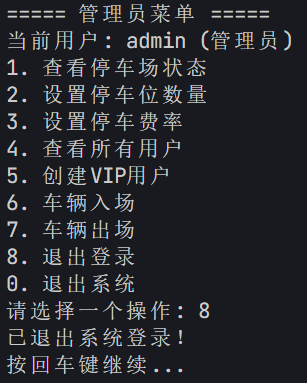

# C++综合实训报告

## 学生信息与系统信息
### 学生信息
- 姓名：123
- 班级：123
- 学号：123

### 系统信息
- 系统名称：停车场管理系统
- 管理员账号：admin
- 管理员密码：admin123

## 一、项目概述
本项目是一个停车场管理系统，采用C++面向对象编程思想开发，实现了用户管理、车辆进出、费用计算等功能。系统支持多种用户类型（管理员、访客、月卡用户、年卡用户），并根据不同用户类型提供差异化的停车费率折扣。

## 二、系统设计
### 2.1 类结构设计
- **User类**：用户基类，包含用户名、密码、用户类型等基本信息，定义了计算停车费的纯虚函数
- **VipUser类**：VIP用户基类，继承自User类，增加了卡类型和到期日期属性
- **ParkingLot类**：停车场类，管理车位信息和车辆进出逻辑
- **Vehicle类**：车辆类，记录车牌号、进出时间和车主信息
- **UserManager类**：用户管理类，负责用户的注册、登录和数据持久化

### 2.2 核心功能模块
1. 用户认证与授权
2. 车辆入场/出场管理
3. 停车费用计算
4. 停车场状态查询

## 三、关键代码实现

### 3.1 核心类成员与方法详解

#### 3.1.1 User类层次结构

**User基类**
- **成员变量**
  - `username` (std::string): 用户名
  - `password` (std::string): 密码
  - `userType` (std::string): 用户类型标识
- **成员方法**
  - 构造函数: `User(const std::string& username = "", const std::string& password = "", const std::string& userType = "Guest")`
  - 析构函数: `virtual ~User() = default`
  - 密码验证: `bool verifyPassword(const std::string& inputPassword) const`
  - 费用计算: `virtual double calculateParkingFee(double baseFee) const = 0` (纯虚函数)
  - Getter方法: `getUsername()`, `getUserType()`

**AdminUser子类**
- **继承关系**: 公有继承自User类
- **成员方法**
  - 费用计算: `double calculateParkingFee(double baseFee) const` (返回0.0，免费停车)

**GuestUser子类**
- **继承关系**: 公有继承自User类
- **成员方法**
  - 费用计算: `double calculateParkingFee(double baseFee) const` (返回baseFee，无折扣)

**VipUser子类**
- **继承关系**: 公有继承自User类
- **扩展成员**
  - `cardType` (std::string): 卡片类型
  - `expiryDate` (std::string): 有效期
- **成员方法**
  - 费用计算: `double calculateParkingFee(double baseFee) const` (返回baseFee * 0.8，8折)

**MonthlyUser子类**
- **继承关系**: 公有继承自VipUser类
- **成员方法**
  - 费用计算: `double calculateParkingFee(double baseFee) const` (返回baseFee * 0.7，7折)

**YearlyUser子类**
- **继承关系**: 公有继承自VipUser类
- **成员方法**
  - 费用计算: `double calculateParkingFee(double baseFee) const` (返回baseFee * 0.5，5折)

#### 3.1.2 Vehicle类
- **成员变量**
  - `plateNumber` (std::string): 车牌号
  - `entryTime` (Time): 入场时间
  - `exitTime` (Time): 出场时间
  - `ownerUsername` (std::string): 车主用户名
- **成员方法**
  - 构造函数: `Vehicle(std::string plateNumber, Time entryTime)`
  - Getter方法: `getPlateNumber()`, `getEntryTime()`, `getExitTime()`, `getOwnerUsername()`
  - Setter方法: `setExitTime(Time exitTime)`, `setOwnerUsername(std::string username)`

#### 3.1.3 ParkingLot类
- **成员变量**
  - `totalSpace` (int): 总车位数
  - `availableSpace` (int): 可用车位数
  - `fee` (double): 基础费率(元/分钟)
  - `vehicles` (std::vector<Vehicle>): 在场车辆列表
- **成员方法**
  - 构造函数: `ParkingLot(int totalSpace, double fee)`
  - 车辆入场: `bool entryParkingLot(Vehicle v)`
  - 车辆出场: `bool exitParkingLot(std::string plateNumber, Time exitTime)`
  - 费用计算: `double calculateFee(Time entryTime, Time exitTime)`
  - 状态查询: `int getAvailableSpace() const`, `int getTotalSpace() const`
  - 车辆查找: `bool findVehicle(const std::string& plateNumber) const`

#### 3.1.4 UserManager类
- **成员变量**
  - `users` (std::vector<std::shared_ptr<User>>): 用户列表
  - `currentUser` (std::shared_ptr<User>): 当前登录用户
- **成员方法**
  - 用户登录: `bool login(const std::string& username, const std::string& password)`
  - 用户登出: `void logout()`
  - 用户注册: `bool registerUser(std::shared_ptr<User> user)`
  - 数据持久化: `bool loadUsers(const std::string& filename)`, `bool saveUsers(const std::string& filename)`
  - 用户创建: `std::shared_ptr<User> createUser(const std::string& type, const std::string& username, const std::string& password)`

#### 3.1.5 Time与Date类

**Time类**
- **成员变量**
  - `date` (Date): 日期
  - `hour` (int): 小时
  - `minute` (int): 分钟
  - `second` (int): 秒
- **成员方法**
  - 构造函数: `Time(int year, int month, int day, int hour, int minute, int second)`
  - 时间显示: `void show() const`
  - 分钟计算: `int getTotalMinutes(const Time &eTime) const`

**Date类**
- **成员变量**
  - `year` (int): 年
  - `month` (int): 月
  - `day` (int): 日
  - `totalDays` (int): 日期偏移量
- **成员方法**
  - 日期计算: `int distance(const Date &d) const`
  - 闰年判断: `bool isLeapYear() const`

## 4. 版本迭代说明

### 4.1 ParkingSystem_1.0
- 实现基础停车场功能，包括车辆进场、出场和费用计算
- 核心类：ParkingLot、Vehicle、Time、Date
- 采用简单的列表存储车辆信息，不支持用户管理
- 费用计算基于停车分钟数乘以费率

### 4.2 ParkingSystem_2.0
- 引入用户系统，实现多用户类型管理（Admin、Guest、VIP）
- 添加用户类层次结构，支持不同用户类型的折扣计算
- 优化停车场管理逻辑，增加车辆唯一性检查
- 核心类：User、AdminUser、GuestUser、VipUser、MonthlyUser、YearlyUser
- 实现基于用户类型的多态费用计算

### 4.3 ParkingSystem_3.0
- 添加用户数据持久化功能，支持用户信息文件存储
- 优化时间计算逻辑，修复秒数处理bug
- 增强错误处理机制，提高系统稳定性
- 实现车辆与用户关联，支持车主信息管理
- 核心改进：UserManager类实现用户数据的加载与保存
- 完善系统菜单交互，提升用户体验

## 5. 系统测试

### 5.1 测试截图

## 6. 总结与展望

### 6.1 项目总结
本停车场管理系统基于C++面向对象编程思想开发，成功实现了以下核心功能：
1. **用户管理**：支持管理员、访客、VIP用户（月卡/年卡）等多角色管理，通过类层次结构和多态实现差异化权限与费率计算。
2. **车辆管理**：实现车辆入场/出场登记、停车时长计算、车位状态监控等功能，采用std::vector存储车辆信息，结合std::find_if算法实现高效查找。
3. **费用计算**：基于时间差的精确计费算法，支持多级折扣策略，通过模板方法模式实现不同用户类型的费用计算。
4. **数据持久化**：通过文件存储用户信息，支持用户数据的加载与保存，确保系统状态的持续性。

系统架构上采用了模块化设计，核心类包括User、Vehicle、ParkingLot和UserManager等，通过合理的类职责划分和接口设计，提高了代码的可读性和可维护性。

### 6.2 系统不足
尽管系统实现了基本功能，但仍存在以下不足：
1. **界面交互**：当前系统基于命令行界面，用户体验较为简陋，缺乏直观的操作指引。
2. **并发控制**：未考虑多用户同时操作的场景，在多线程环境下可能存在数据竞争问题。
3. **数据存储**：采用文本文件存储用户数据，安全性和查询效率有待提升。
4. **异常处理**：错误处理机制不够完善，部分边界情况（如日期格式错误）未做充分校验。

### 6.3 未来展望
针对现有不足，未来可从以下方向进行优化与扩展：
1. **图形用户界面**：引入Qt或MFC框架开发GUI界面，提升用户交互体验。
2. **数据库集成**：将用户数据和车辆记录迁移至MySQL或SQLite数据库，提高数据管理效率和安全性。
3. **并发控制**：引入线程同步机制（如互斥锁），支持多用户并发操作。
4. **功能扩展**：
   - 添加车位预约功能，支持用户提前预定车位
   - 实现停车场空位实时监控与导航
   - 集成移动支付接口，支持扫码缴费